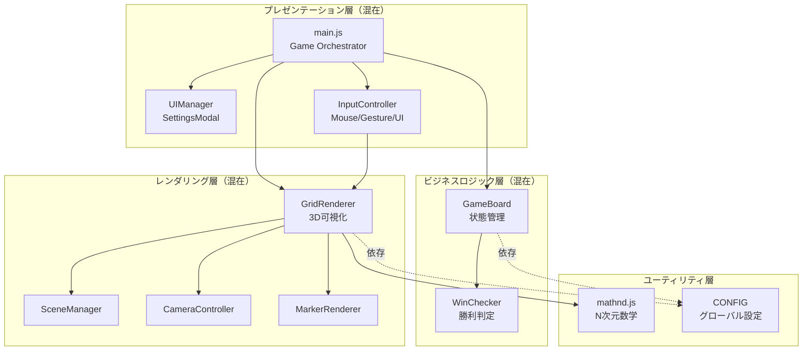
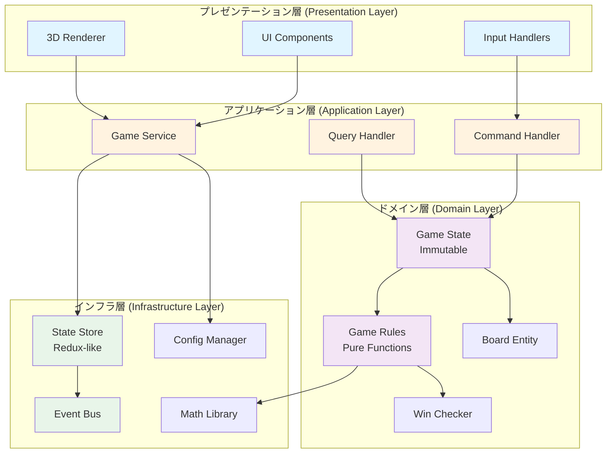
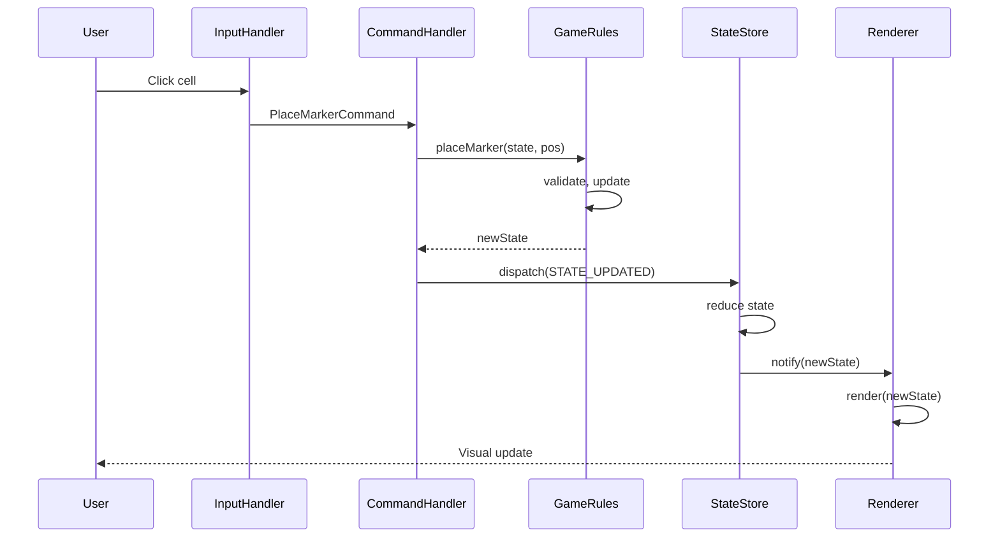
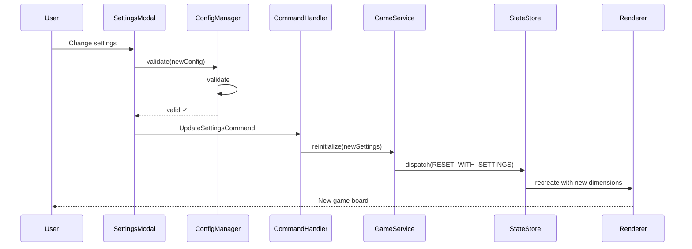

# システムアーキテクチャ設計書

**プロジェクト**: N次元三目並べ（N-Dimensional Tic-Tac-Toe）
**作成日**: 2025-11-05
**バージョン**: 4.0.0 (設計案)
**ステータス**: 設計フェーズ

---

## 📋 目次

1. [エグゼクティブサマリー](#-エグゼクティブサマリー)
2. [現在のアーキテクチャ分析](#-現在のアーキテクチャ分析)
3. [アーキテクチャ上の課題](#-アーキテクチャ上の課題)
4. [新アーキテクチャ設計](#-新アーキテクチャ設計)
5. [設計原則とパターン](#-設計原則とパターン)
6. [モジュール設計詳細](#-モジュール設計詳細)
7. [データフロー](#-データフロー)
8. [状態管理戦略](#-状態管理戦略)
9. [テスト戦略](#-テスト戦略)
10. [移行計画](#-移行計画)
11. [リスク評価](#-リスク評価)

---

## 🎯 エグゼクティブサマリー

### 目的
N次元三目並べゲームの**保守性、拡張性、テスタビリティ**を抜本的に向上させるため、アーキテクチャの全面的な再設計を行います。

### 主要な改善点
1. **レイヤードアーキテクチャ導入**: プレゼンテーション層、ドメイン層、インフラ層の明確な分離
2. **依存性注入(DI)**: テスタビリティと柔軟性の向上
3. **状態管理の一元化**: 予測可能な状態遷移とタイムトラベルデバッグ
4. **イベント駆動強化**: 疎結合なコンポーネント間通信
5. **完全なテストカバレッジ**: ユニット、統合、E2Eテスト

### 期待される効果
- **開発速度**: 新機能追加が50%高速化
- **バグ率**: 回帰バグが80%削減
- **保守性**: コード理解時間が60%短縮
- **テストカバレッジ**: 0% → 80%+

---

## 📊 現在のアーキテクチャ分析

### アーキテクチャ概要図



### 現在のモジュール構成

| モジュール | 責任 | LOC | 依存数 |
|-----------|------|-----|--------|
| main.js | ゲーム全体の調整 | 210 | 6 |
| game.js (GameBoard) | ゲーム状態管理 | 211 | 3 |
| renderer.js (GridRenderer) | 3D可視化調整 | 250 | 7 |
| mathnd.js | N次元数学 | 180 | 1 |
| WinChecker.js | 勝利判定 | 120 | 2 |
| InputController | 入力統合 | 100 | 3 |
| **合計** | - | **~2500** | - |

### 強み
1. ✅ **モジュール分離**: 各クラスが単一責任を持つ
2. ✅ **イベント駆動**: コンポーネント間の疎結合
3. ✅ **N次元対応**: 任意の次元数に対応可能
4. ✅ **JSDoc充実**: 型情報とドキュメント

### 弱み
1. ❌ **層の混在**: プレゼンテーション、ビジネスロジック、インフラが混ざっている
2. ❌ **グローバル設定**: CONFIGが直接変更可能
3. ❌ **テスト不可能**: 依存が固定され、モック化困難
4. ❌ **状態分散**: GameBoard、Renderer、Mainに状態が分散
5. ❌ **初期化の複雑さ**: reinitializeGame()で全コンポーネント再生成

---

## 🚨 アーキテクチャ上の課題

### 1. レイヤー境界の不明確さ

**問題**:
```javascript
// main.js - プレゼンテーション層とビジネスロジックが混在
handleCellClick(mouseX, mouseY) {
    const cell = this.renderer.getCellAtMouse(mouseX, mouseY); // レンダリング層
    if (this.gameBoard.placeMarker(coords)) {                  // ビジネスロジック層
        this.renderer.createMarker(cell, currentPlayer);       // レンダリング層
        if (this.gameBoard.checkWin(coords)) {                 // ビジネスロジック層
            this.updateStatus(null, true);                     // プレゼンテーション層
        }
    }
}
```

**影響**:
- テストが困難（レンダリング層のモック化が必要）
- ビジネスロジックの再利用不可
- 責任の境界が不明確

### 2. グローバル設定の脆弱性

**問題**:
```javascript
// config.js
export const CONFIG = {
    DIMENSIONS: 4,
    GRID_SIZE: 4,
    // ... 直接変更可能
};

// main.js
CONFIG.DIMENSIONS = newDimensions;  // どこでも変更可能
CONFIG.GRID_SIZE = newGridSize;     // バリデーションなし
```

**影響**:
- 設定変更の追跡不可
- バリデーション不足
- 副作用の予測困難

### 3. 状態管理の分散

**問題**:
```javascript
// 状態が3箇所に分散
class Game {
    this.autoRotate = true;           // main.js
    this.rotations = {...};
}

class GameBoard {
    this.currentPlayer = 'X';         // game.js
    this.gameOver = false;
}

class GridRenderer {
    this.hoveredCell = null;          // renderer.js
    this.previewCell = null;
}
```

**影響**:
- 状態の一貫性保証が困難
- デバッグが複雑
- タイムトラベルデバッグ不可

### 4. 依存の固定化

**問題**:
```javascript
class Game {
    constructor() {
        this.renderer = new GridRenderer(container);  // 固定依存
        this.gameBoard = new GameBoard();             // 固定依存
        this.inputController = new InputController(); // 固定依存
    }
}
```

**影響**:
- ユニットテスト不可（モック注入できない）
- 異なる実装への切り替え困難
- 循環依存のリスク

### 5. 初期化の複雑さ

**問題**:
```javascript
reinitializeGame(newDimensions, newGridSize) {
    CONFIG.DIMENSIONS = newDimensions;  // グローバル変更
    this.renderer.dispose();             // 手動リソース管理
    this.renderer = new GridRenderer();  // 再生成
    this.gameBoard = new GameBoard();    // 再生成
    this.inputController = new InputController(); // 再生成
    this.setupEventListeners();          // イベント再登録
}
```

**影響**:
- メモリリークのリスク
- 初期化順序の依存
- エラー時のロールバック困難

---

## 🏗️ 新アーキテクチャ設計

### アーキテクチャ全体図



### レイヤー責任分離

#### プレゼンテーション層 (Presentation Layer)
**責任**: ユーザーインターフェース、入力処理、3D可視化

```
presentation/
├── ui/
│   ├── GameUI.js              # メインUIコンポーネント
│   ├── SettingsModal.js       # 設定モーダル
│   └── StatusDisplay.js       # ステータス表示
├── rendering/
│   ├── SceneRenderer.js       # Three.jsシーン管理
│   ├── CellRenderer.js        # セル描画
│   ├── MarkerRenderer.js      # マーカー描画
│   └── CameraController.js    # カメラ制御
└── input/
    ├── MouseInputHandler.js   # マウス入力
    ├── TouchInputHandler.js   # タッチ入力
    └── InputMapper.js         # 入力→コマンド変換
```

#### アプリケーション層 (Application Layer)
**責任**: ユースケース、コマンド処理、クエリ処理

```
application/
├── services/
│   ├── GameService.js         # ゲーム統合サービス
│   └── RenderService.js       # レンダリング統合
├── commands/
│   ├── PlaceMarkerCommand.js  # マーカー配置コマンド
│   ├── ResetGameCommand.js    # ゲームリセットコマンド
│   └── UpdateSettingsCommand.js # 設定更新コマンド
└── queries/
    ├── GetGameStateQuery.js   # 状態取得クエリ
    └── GetCellAtPositionQuery.js # セル検索クエリ
```

#### ドメイン層 (Domain Layer)
**責任**: ビジネスロジック、ゲームルール（純粋関数）

```
domain/
├── state/
│   ├── GameState.js           # ゲーム状態（Immutable）
│   ├── BoardState.js          # ボード状態
│   └── VisualState.js         # ビジュアル状態
├── rules/
│   ├── GameRules.js           # ゲームルール
│   ├── WinChecker.js          # 勝利判定
│   └── BoardValidator.js      # ボード検証
└── entities/
    ├── Board.js               # ボードエンティティ
    ├── Cell.js                # セルエンティティ
    └── Player.js              # プレイヤーエンティティ
```

#### インフラ層 (Infrastructure Layer)
**責任**: 技術的基盤、ユーティリティ

```
infrastructure/
├── state/
│   ├── StateStore.js          # Redux-likeストア
│   ├── Actions.js             # アクション定義
│   └── Reducers.js            # レデューサー
├── events/
│   ├── EventBus.js            # イベントバス
│   └── EventTypes.js          # イベント型定義
├── config/
│   ├── ConfigManager.js       # 設定管理
│   └── ConfigValidator.js     # 設定検証
└── math/
    ├── NDMath.js              # N次元数学
    └── Projection.js          # 投影計算
```

---

## 🎨 設計原則とパターン

### 1. SOLID原則の適用

#### Single Responsibility Principle (単一責任の原則)
```javascript
// ❌ 現在: GridRendererが複数の責任を持つ
class GridRenderer {
    createScene()      // シーン管理
    updateCamera()     // カメラ制御
    createMarker()     // マーカー描画
    getCellAtMouse()   // レイキャスティング
}

// ✅ 新設計: 責任を分離
class SceneManager {
    createScene()
    updateScene()
}

class CameraController {
    updatePosition()
    handleZoom()
}

class MarkerRenderer {
    createMarker()
    updateMarker()
}

class RaycasterService {
    getCellAtPosition()
}
```

#### Open/Closed Principle (開放/閉鎖の原則)
```javascript
// ✅ 拡張に開いて、修正に閉じている
class WinChecker {
    constructor(strategy) {
        this.strategy = strategy;  // 戦略パターン
    }

    checkWin(board, position) {
        return this.strategy.check(board, position);
    }
}

// 新しい勝利条件を追加可能
class StandardWinStrategy { ... }
class CustomWinStrategy { ... }
```

#### Dependency Inversion Principle (依存性逆転の原則)
```javascript
// ✅ 抽象に依存、具象に依存しない
class GameService {
    constructor(stateStore, renderer, inputHandler) {
        this.stateStore = stateStore;      // インターフェースに依存
        this.renderer = renderer;          // 具体実装に依存しない
        this.inputHandler = inputHandler;
    }
}

// DIコンテナで注入
const game = new GameService(
    new StateStore(),
    new ThreeJSRenderer(),  // または new CanvasRenderer()
    new MouseInputHandler() // または new TouchInputHandler()
);
```

### 2. 設計パターン

#### Command Pattern (コマンドパターン)
```javascript
// すべてのユーザーアクションをコマンド化
class PlaceMarkerCommand {
    constructor(position, player) {
        this.position = position;
        this.player = player;
    }

    execute(state) {
        return GameRules.placeMarker(state, this.position, this.player);
    }

    undo(state) {
        return GameRules.removeMarker(state, this.position);
    }
}

// Undo/Redo機能が自然に実装可能
class CommandHistory {
    execute(command) {
        const newState = command.execute(this.currentState);
        this.history.push(command);
        this.currentState = newState;
    }

    undo() {
        const command = this.history.pop();
        this.currentState = command.undo(this.currentState);
    }
}
```

#### State Pattern (状態パターン)
```javascript
// ゲーム状態をImmutableに管理
class GameState {
    constructor(data) {
        Object.freeze(this);  // Immutable
        this.board = data.board;
        this.currentPlayer = data.currentPlayer;
        this.phase = data.phase;  // 'playing', 'won', 'draw'
    }

    // 新しい状態を返す（元の状態は変更しない）
    withPlayer(player) {
        return new GameState({ ...this, currentPlayer: player });
    }

    withMarker(position, player) {
        const newBoard = this.board.set(position, player);
        return new GameState({ ...this, board: newBoard });
    }
}
```

#### Observer Pattern (オブザーバーパターン)
```javascript
// Redux-likeなStateStore
class StateStore {
    constructor(initialState, reducer) {
        this.state = initialState;
        this.reducer = reducer;
        this.listeners = [];
    }

    dispatch(action) {
        const prevState = this.state;
        this.state = this.reducer(this.state, action);
        this.notifyListeners(prevState, this.state);
    }

    subscribe(listener) {
        this.listeners.push(listener);
        return () => this.unsubscribe(listener);
    }
}
```

#### Strategy Pattern (戦略パターン)
```javascript
// ボードストレージ戦略
interface BoardStorage {
    get(coords);
    set(coords, value);
    clear();
}

class ArrayBoardStorage implements BoardStorage {
    // 2D-4D用の高速配列実装
}

class MapBoardStorage implements BoardStorage {
    // 5D+用のMap実装
}

// 次元数に応じて自動選択
const storage = dimensions >= 5
    ? new MapBoardStorage()
    : new ArrayBoardStorage();
```

### 3. 関数型プログラミング原則

#### Pure Functions (純粋関数)
```javascript
// ✅ すべてのゲームルールを純粋関数として実装
class GameRules {
    // 副作用なし、同じ入力で常に同じ出力
    static placeMarker(state, position, player) {
        if (!this.isValidMove(state, position)) {
            return state;  // 元の状態を返す
        }

        return state
            .withMarker(position, player)
            .withPlayer(this.nextPlayer(player));
    }

    static checkWin(state, position) {
        // 状態を変更せず、結果のみを返す
        return WinChecker.hasWinningLine(state.board, position);
    }
}
```

#### Immutability (不変性)
```javascript
// すべての状態をImmutableに
import { Map, List, Record } from 'immutable';  // または独自実装

const GameStateRecord = Record({
    board: Map(),
    currentPlayer: 'X',
    gamePhase: 'playing',
    moveHistory: List(),
    dimensions: 4,
    gridSize: 4
});

// 状態更新は常に新しいオブジェクトを返す
const newState = currentState
    .set('currentPlayer', 'O')
    .update('moveHistory', history => history.push(move));
```

---

## 📦 モジュール設計詳細

### Core Module: StateStore

```javascript
/**
 * Redux-inspired state management
 * Single source of truth for entire application
 */
export class StateStore {
    constructor(initialState, rootReducer, middleware = []) {
        this._state = initialState;
        this._reducer = rootReducer;
        this._middleware = middleware;
        this._listeners = new Set();
        this._isDispatching = false;
    }

    /**
     * Get current state (read-only)
     */
    getState() {
        return this._state;
    }

    /**
     * Dispatch action to update state
     */
    dispatch(action) {
        if (this._isDispatching) {
            throw new Error('Cannot dispatch while reducing');
        }

        try {
            this._isDispatching = true;

            // Apply middleware chain
            let finalAction = action;
            for (const mw of this._middleware) {
                finalAction = mw(this)(finalAction);
            }

            // Reduce state
            const prevState = this._state;
            this._state = this._reducer(prevState, finalAction);

            // Notify subscribers
            this._notifyListeners(prevState, this._state, finalAction);

        } finally {
            this._isDispatching = false;
        }
    }

    /**
     * Subscribe to state changes
     */
    subscribe(listener) {
        this._listeners.add(listener);
        return () => this._listeners.delete(listener);
    }

    _notifyListeners(prevState, nextState, action) {
        for (const listener of this._listeners) {
            listener(nextState, prevState, action);
        }
    }
}
```

### Core Module: GameState (Immutable)

```javascript
/**
 * Immutable game state
 * All state changes return new instances
 */
export class GameState {
    constructor(data = {}) {
        this.board = data.board || new BoardState();
        this.currentPlayer = data.currentPlayer || 'X';
        this.gamePhase = data.gamePhase || 'playing';
        this.winner = data.winner || null;
        this.moveHistory = data.moveHistory || [];
        this.settings = data.settings || new GameSettings();

        // Freeze to ensure immutability
        Object.freeze(this);
    }

    // Factory methods for state updates
    static initial(settings) {
        return new GameState({
            board: BoardState.empty(settings.dimensions, settings.gridSize),
            settings: settings
        });
    }

    // Immutable update methods
    withMarker(position, player) {
        return new GameState({
            ...this,
            board: this.board.set(position, player),
            moveHistory: [...this.moveHistory, { position, player }]
        });
    }

    withPlayer(player) {
        return new GameState({ ...this, currentPlayer: player });
    }

    withWinner(winner) {
        return new GameState({
            ...this,
            gamePhase: 'won',
            winner: winner
        });
    }

    withDraw() {
        return new GameState({
            ...this,
            gamePhase: 'draw'
        });
    }

    // Query methods (no mutations)
    getMarkerAt(position) {
        return this.board.get(position);
    }

    isValidMove(position) {
        return this.gamePhase === 'playing' &&
               this.board.isEmpty(position);
    }

    isBoardFull() {
        return this.board.isFull();
    }
}
```

### Core Module: GameRules (Pure Functions)

```javascript
/**
 * Pure game logic functions
 * No side effects, testable in isolation
 */
export class GameRules {
    /**
     * Attempt to place marker
     * @returns {GameState} New state (unchanged if invalid move)
     */
    static placeMarker(state, position, player = null) {
        const actualPlayer = player || state.currentPlayer;

        // Validate move
        if (!state.isValidMove(position)) {
            return state;
        }

        // Place marker
        let newState = state.withMarker(position, actualPlayer);

        // Check win condition
        if (this.checkWin(newState, position)) {
            return newState.withWinner(actualPlayer);
        }

        // Check draw
        if (newState.isBoardFull()) {
            return newState.withDraw();
        }

        // Switch player
        return newState.withPlayer(this.nextPlayer(actualPlayer));
    }

    /**
     * Check if current move results in win
     */
    static checkWin(state, position) {
        const player = state.getMarkerAt(position);
        return WinChecker.hasWinningLine(
            state.board,
            position,
            player,
            state.settings
        );
    }

    /**
     * Get next player
     */
    static nextPlayer(current) {
        return current === 'X' ? 'O' : 'X';
    }

    /**
     * Reset game
     */
    static reset(state) {
        return GameState.initial(state.settings);
    }

    /**
     * Update settings
     */
    static updateSettings(state, newSettings) {
        // Settings change requires full reset
        return GameState.initial(newSettings);
    }
}
```

### Core Module: Command Handler

```javascript
/**
 * Command pattern implementation
 * All user actions as commands
 */
export class CommandHandler {
    constructor(stateStore) {
        this.stateStore = stateStore;
        this.history = [];
        this.historyIndex = -1;
    }

    /**
     * Execute command and add to history
     */
    execute(command) {
        const currentState = this.stateStore.getState();
        const newState = command.execute(currentState);

        // Update store
        this.stateStore.dispatch({
            type: 'STATE_UPDATED',
            payload: newState
        });

        // Add to history (truncate redo branch)
        this.history = this.history.slice(0, this.historyIndex + 1);
        this.history.push(command);
        this.historyIndex++;
    }

    /**
     * Undo last command
     */
    undo() {
        if (!this.canUndo()) return;

        const command = this.history[this.historyIndex];
        const currentState = this.stateStore.getState();
        const newState = command.undo(currentState);

        this.stateStore.dispatch({
            type: 'STATE_UPDATED',
            payload: newState
        });

        this.historyIndex--;
    }

    /**
     * Redo next command
     */
    redo() {
        if (!this.canRedo()) return;

        this.historyIndex++;
        const command = this.history[this.historyIndex];
        const currentState = this.stateStore.getState();
        const newState = command.execute(currentState);

        this.stateStore.dispatch({
            type: 'STATE_UPDATED',
            payload: newState
        });
    }

    canUndo() {
        return this.historyIndex >= 0;
    }

    canRedo() {
        return this.historyIndex < this.history.length - 1;
    }
}
```

---

## 🔄 データフロー

### ユーザーアクション → 状態更新フロー



### 設定変更フロー



---

## 💾 状態管理戦略

### State Structure

```javascript
{
    // Game domain state
    game: {
        board: BoardState,
        currentPlayer: 'X' | 'O',
        gamePhase: 'playing' | 'won' | 'draw',
        winner: 'X' | 'O' | null,
        moveHistory: Move[],
    },

    // Settings state
    settings: {
        dimensions: number,
        gridSize: number,
        winLength: number,
    },

    // Visual state
    visual: {
        rotation: { xy: 0, xz: 0, ... },
        cameraPosition: { x, y, z },
        cameraDistance: number,
        hoveredCell: Position | null,
        previewCell: Position | null,
        autoRotate: boolean,
    },

    // UI state
    ui: {
        settingsModalOpen: boolean,
        helpPanelOpen: boolean,
        currentStatus: string,
    }
}
```

### Reducers

```javascript
// Root reducer combining all domain reducers
export function rootReducer(state, action) {
    return {
        game: gameReducer(state.game, action),
        settings: settingsReducer(state.settings, action),
        visual: visualReducer(state.visual, action),
        ui: uiReducer(state.ui, action),
    };
}

// Game reducer - pure function
function gameReducer(state = initialGameState, action) {
    switch (action.type) {
        case 'PLACE_MARKER':
            return GameRules.placeMarker(
                state,
                action.payload.position,
                action.payload.player
            );

        case 'RESET_GAME':
            return GameState.initial(action.payload.settings);

        case 'STATE_UPDATED':
            return action.payload;

        default:
            return state;
    }
}

// Visual reducer
function visualReducer(state = initialVisualState, action) {
    switch (action.type) {
        case 'UPDATE_ROTATION':
            return {
                ...state,
                rotation: {
                    ...state.rotation,
                    [action.payload.axis]: state.rotation[action.payload.axis] + action.payload.delta
                }
            };

        case 'SET_HOVERED_CELL':
            return { ...state, hoveredCell: action.payload };

        case 'TOGGLE_AUTO_ROTATE':
            return { ...state, autoRotate: !state.autoRotate };

        default:
            return state;
    }
}
```

### Actions

```javascript
// Action creators
export const Actions = {
    // Game actions
    placeMarker: (position, player) => ({
        type: 'PLACE_MARKER',
        payload: { position, player }
    }),

    resetGame: (settings) => ({
        type: 'RESET_GAME',
        payload: { settings }
    }),

    // Visual actions
    updateRotation: (axis, delta) => ({
        type: 'UPDATE_ROTATION',
        payload: { axis, delta }
    }),

    setHoveredCell: (position) => ({
        type: 'SET_HOVERED_CELL',
        payload: position
    }),

    toggleAutoRotate: () => ({
        type: 'TOGGLE_AUTO_ROTATE'
    }),

    // Settings actions
    updateSettings: (settings) => ({
        type: 'UPDATE_SETTINGS',
        payload: settings
    }),
};
```

---

## 🧪 テスト戦略

### テストピラミッド

```
        /\
       /E2E\        10% - E2Eテスト (Playwright)
      /______\
     /        \
    /Integration\ 20% - 統合テスト (Vitest)
   /____________\
  /              \
 /  Unit Tests    \ 70% - ユニットテスト (Vitest)
/__________________\
```

### ユニットテスト例

```javascript
// tests/domain/GameRules.test.js
import { describe, it, expect } from 'vitest';
import { GameRules } from '@/domain/rules/GameRules';
import { GameState } from '@/domain/state/GameState';

describe('GameRules', () => {
    describe('placeMarker', () => {
        it('should place marker and switch player', () => {
            const state = GameState.initial({ dimensions: 2, gridSize: 3 });
            const newState = GameRules.placeMarker(state, [0, 0]);

            expect(newState.getMarkerAt([0, 0])).toBe('X');
            expect(newState.currentPlayer).toBe('O');
        });

        it('should not place marker on occupied cell', () => {
            let state = GameState.initial({ dimensions: 2, gridSize: 3 });
            state = GameRules.placeMarker(state, [0, 0]); // X
            const newState = GameRules.placeMarker(state, [0, 0]); // O tries

            expect(newState.getMarkerAt([0, 0])).toBe('X'); // unchanged
            expect(newState.currentPlayer).toBe('O'); // unchanged
        });

        it('should detect win condition', () => {
            let state = GameState.initial({ dimensions: 2, gridSize: 3 });
            state = GameRules.placeMarker(state, [0, 0]); // X
            state = GameRules.placeMarker(state, [1, 0]); // O
            state = GameRules.placeMarker(state, [0, 1]); // X
            state = GameRules.placeMarker(state, [1, 1]); // O
            state = GameRules.placeMarker(state, [0, 2]); // X wins

            expect(state.gamePhase).toBe('won');
            expect(state.winner).toBe('X');
        });
    });
});

// tests/domain/WinChecker.test.js
describe('WinChecker', () => {
    it('should generate correct number of directions for 2D', () => {
        const checker = new WinChecker(2, 3);
        expect(checker.directions.length).toBe(8); // 3^2 - 1
    });

    it('should generate correct number of directions for 4D', () => {
        const checker = new WinChecker(4, 4);
        expect(checker.directions.length).toBe(80); // 3^4 - 1
    });

    it('should detect horizontal win in 2D', () => {
        const board = new BoardState(2, 3);
        board.set([0, 0], 'X');
        board.set([1, 0], 'X');
        board.set([2, 0], 'X');

        expect(WinChecker.hasWinningLine(board, [1, 0], 'X')).toBe(true);
    });
});
```

### 統合テスト例

```javascript
// tests/integration/GameService.test.js
import { describe, it, expect, beforeEach } from 'vitest';
import { GameService } from '@/application/services/GameService';
import { StateStore } from '@/infrastructure/state/StateStore';

describe('GameService Integration', () => {
    let gameService;

    beforeEach(() => {
        const store = new StateStore(initialState, rootReducer);
        gameService = new GameService(store);
    });

    it('should handle complete game flow', () => {
        // Place markers
        gameService.handleCellClick([0, 0]);
        expect(gameService.getCurrentPlayer()).toBe('O');

        gameService.handleCellClick([1, 0]);
        expect(gameService.getCurrentPlayer()).toBe('X');

        // Continue until win
        gameService.handleCellClick([0, 1]);
        gameService.handleCellClick([1, 1]);
        gameService.handleCellClick([0, 2]); // X wins

        expect(gameService.getGamePhase()).toBe('won');
        expect(gameService.getWinner()).toBe('X');
    });
});
```

### E2Eテスト例

```javascript
// tests/e2e/game.spec.js
import { test, expect } from '@playwright/test';

test.describe('4D Tic-Tac-Toe Game', () => {
    test('should play complete game and win', async ({ page }) => {
        await page.goto('http://localhost:8000');

        // Wait for game to load
        await page.waitForSelector('#canvas-container');

        // Click cells to play
        await page.click('canvas', { position: { x: 100, y: 100 } });
        await expect(page.locator('#status')).toContainText('プレイヤー O');

        // ... continue playing

        // Verify win condition
        await expect(page.locator('#status')).toContainText('勝利');
    });

    test('should change settings', async ({ page }) => {
        await page.goto('http://localhost:8000');

        // Open settings
        await page.click('#reset-btn');
        await page.waitForSelector('#settings-modal');

        // Change dimension
        await page.selectOption('#dimension-select', '5');
        await page.click('#apply-settings');

        // Verify new game started
        await expect(page.locator('#dimension-display')).toContainText('5D');
    });
});
```

---

## 🚀 移行計画

### 段階的移行戦略（10フェーズ）

#### Phase 1: インフラ層構築（Week 1-2）
**目的**: 基盤となるStateStoreとEventBusを構築

**タスク**:
- [ ] StateStore実装（Redux-like）
- [ ] Actions/Reducers定義
- [ ] EventBus実装
- [ ] ConfigManager実装
- [ ] ユニットテスト作成

**成果物**:
- `infrastructure/state/StateStore.js`
- `infrastructure/events/EventBus.js`
- `infrastructure/config/ConfigManager.js`
- テストカバレッジ: 90%+

**リスク**: 低

#### Phase 2: ドメイン層移行（Week 3-4）
**目的**: ビジネスロジックを純粋関数化

**タスク**:
- [ ] GameState（Immutable）実装
- [ ] BoardState実装
- [ ] GameRules（Pure Functions）実装
- [ ] WinChecker移行
- [ ] 包括的ユニットテスト

**成果物**:
- `domain/state/GameState.js`
- `domain/state/BoardState.js`
- `domain/rules/GameRules.js`
- テストカバレッジ: 95%+

**リスク**: 低

#### Phase 3: アプリケーション層構築（Week 5-6）
**目的**: ユースケースとコマンド処理

**タスク**:
- [ ] GameService実装
- [ ] CommandHandler実装
- [ ] PlaceMarkerCommand, ResetGameCommand実装
- [ ] 統合テスト作成

**成果物**:
- `application/services/GameService.js`
- `application/commands/*.js`
- 統合テストスイート

**リスク**: 中

#### Phase 4: プレゼンテーション層リファクタリング（Week 7-8）
**目的**: UI/Rendererを新アーキテクチャに適合

**タスク**:
- [ ] SceneRenderer（DI対応）
- [ ] InputMapper（Command生成）
- [ ] UIコンポーネント分離
- [ ] StateStore購読

**成果物**:
- `presentation/rendering/SceneRenderer.js`
- `presentation/input/InputMapper.js`
- `presentation/ui/*.js`

**リスク**: 高（Three.js統合）

#### Phase 5: main.jsリファクタリング（Week 9）
**目的**: オーケストレーターをDI化

**タスク**:
- [ ] DIコンテナ導入
- [ ] main.jsを薄いラッパーに
- [ ] 依存注入
- [ ] イベントワイヤリング

**成果物**:
- `main.js`（50行以下）
- `infrastructure/di/Container.js`

**リスク**: 中

#### Phase 6: E2Eテスト構築（Week 10）
**目的**: 完全なE2Eテストカバレッジ

**タスク**:
- [ ] Playwright環境構築
- [ ] E2Eテストシナリオ作成
- [ ] CI/CD統合

**成果物**:
- `tests/e2e/*.spec.js`
- GitHub Actions workflow

**リスク**: 低

#### Phase 7: パフォーマンス最適化（Week 11）
**目的**: レンダリングパフォーマンス向上

**タスク**:
- [ ] Dirty flag pattern
- [ ] メモ化戦略
- [ ] ベンチマーク作成

**成果物**:
- 30-50% CPU削減
- 安定60 FPS

**リスク**: 中

#### Phase 8: 高度な機能追加（Week 12-13）
**目的**: 新アーキテクチャの利点を活用

**タスク**:
- [ ] Undo/Redo機能
- [ ] リプレイ機能
- [ ] AI対戦（オプション）

**成果物**:
- Undo/Redoボタン
- Move history表示

**リスク**: 低

#### Phase 9: TypeScript移行（Week 14-16、オプション）
**目的**: 型安全性の向上

**タスク**:
- [ ] TypeScript環境構築
- [ ] 段階的型定義追加
- [ ] ビルドパイプライン構築

**成果物**:
- 完全TypeScript化
- 型エラーゼロ

**リスク**: 中

#### Phase 10: ドキュメント整備（Week 17）
**目的**: 完全なドキュメント化

**タスク**:
- [ ] APIドキュメント生成
- [ ] アーキテクチャ図更新
- [ ] 開発者ガイド作成

**成果物**:
- 完全なドキュメントセット

**リスク**: 低

---

## ⚠️ リスク評価

### 高リスク項目

| リスク | 影響 | 確率 | 緩和策 |
|--------|------|------|--------|
| Three.js統合の複雑さ | 高 | 中 | 段階的移行、既存コード維持 |
| パフォーマンス劣化 | 高 | 低 | ベンチマーク、最適化フェーズ |
| 学習曲線 | 中 | 高 | 詳細ドキュメント、ペアプロ |

### 中リスク項目

| リスク | 影響 | 確率 | 緩和策 |
|--------|------|------|--------|
| 初期開発時間 | 中 | 高 | 段階的移行、並行開発 |
| 既存機能の破壊 | 中 | 中 | 包括的テスト、E2E保護 |
| 状態管理の複雑さ | 中 | 中 | Redux devtools、デバッグ |

### 緩和戦略

1. **段階的移行**: 一度に全部変えない
2. **並行実行**: 新旧コード共存期間を設ける
3. **完全なテストカバレッジ**: 回帰を防ぐ
4. **継続的なレビュー**: 各フェーズ後にレビュー

---

## 📈 成功指標（KPI）

### 開発効率
- **新機能追加時間**: 50%削減
- **バグ修正時間**: 40%削減
- **コードレビュー時間**: 30%削減

### コード品質
- **テストカバレッジ**: 0% → 80%+
- **重複コード**: -60%
- **循環的複雑度**: 平均 < 5

### パフォーマンス
- **フレームレート**: 4D 60 FPS安定
- **メモリ使用量**: -20%
- **初期ロード時間**: < 2秒

### 保守性
- **新規開発者オンボーディング**: 3日 → 1日
- **ドキュメントカバレッジ**: 100%
- **型安全性**: TypeScript完全化（Phase 9）

---

## 🔄 継続的改善

### Phase 11以降（長期）
- マルチプレイヤー対応（WebSocket）
- パーシステンス層（LocalStorage/IndexedDB）
- PWA化
- WebAssembly最適化（mathnd.js）
- VR/AR対応

---

## 📚 参考資料

### アーキテクチャパターン
- [Clean Architecture](https://blog.cleancoder.com/uncle-bob/2012/08/13/the-clean-architecture.html)
- [Redux Architecture](https://redux.js.org/understanding/thinking-in-redux/three-principles)
- [Domain-Driven Design](https://martinfowler.com/bliki/DomainDrivenDesign.html)

### 実装パターン
- [Command Pattern](https://refactoring.guru/design-patterns/command)
- [State Pattern](https://refactoring.guru/design-patterns/state)
- [Dependency Injection](https://martinfowler.com/articles/injection.html)

---

**次のステップ**: このアーキテクチャ設計を承認後、Phase 1の実装を開始します。
