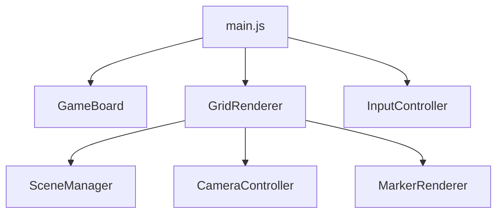

# リファクタリング計画 / Refactoring Plan

**プロジェクト**: N次元三目並べ（N-Dimensional Tic-Tac-Toe）
**作成日**: 2025-11-05
**バージョン**: 3.3.0

---

## 📋 目次

1. [発見された重大なバグ](#-発見された重大なバグ)
2. [リファクタリングフェーズ](#-リファクタリングフェーズ)
3. [推奨実施順序](#-推奨実施順序)
4. [コード品質評価](#-コード品質評価)

---

## 🐛 発見された重大なバグ

### バグ1: SceneManager.js - イベントリスナーのメモリリーク ⚠️

**場所**: `js/rendering/SceneManager.js:180`

```javascript
// 現在のコード（バグ）
window.removeEventListener('resize', this.handleResize.bind(this));
```

**問題**:
- `bind(this)`は毎回新しい関数を作成するため、`addEventListener`で登録した関数と`removeEventListener`で削除しようとする関数が異なる
- 結果として、イベントリスナーが削除されず、ゲームをリセットするたびにリスナーが蓄積される

**影響**:
- メモリリーク
- ゲームリセット後のパフォーマンス劣化
- 複数のリスナーが同時に発火

**修正方法**:
```javascript
// setupResizeHandler()で
this.boundHandleResize = this.handleResize.bind(this);
window.addEventListener('resize', this.boundHandleResize);

// dispose()で
window.removeEventListener('resize', this.boundHandleResize);
```

---

### バグ2: MarkerRenderer.js - cell.markerの型不整合 ⚠️

**場所**: `js/rendering/MarkerRenderer.js:25, 55, 81`

```javascript
// 3つの異なる値を使用
cell.marker = true;      // line 25 - boolean
cell.marker = null;      // line 55 - null
hasMarker(cell) {
    return cell.marker !== null && cell.marker !== false;  // line 81 - 両方をチェック
}
```

**問題**:
- `cell.marker`の型が一貫していない（true / null / undefined の混在）
- コメントには「sprite object」と書いてあるが、実際は`true`を設定している
- `cell.player`プロパティも同時に存在し、責任が分散

**影響**:
- 型の混乱
- 潜在的なバグ（他のコードが誤った型を期待する可能性）
- コードの理解困難

**修正方法**:
```javascript
// 一貫してbooleanを使用
cell.marker = true;
cell.marker = false;  // nullの代わりにfalseを使用

// またはnull/objectパターンに統一
cell.marker = { player: 'X' };
cell.marker = null;
```

---

## 🔄 リファクタリングフェーズ

### フェーズ1: 緊急バグ修正（優先度：最高 🔴）

**目的**: リファクタリングの妨げとなる明らかなバグを修正

#### 1.1 SceneManagerのメモリリーク修正
- [ ] `setupResizeHandler()`でbound関数を`this.boundHandleResize`に保存
- [ ] `dispose()`で正しく削除
- **影響範囲**: 1ファイル（`js/rendering/SceneManager.js`）

#### 1.2 MarkerRendererの型整合性修正
- [ ] `cell.marker`を一貫してbooleanとして扱う
- [ ] または完全にnull/objectパターンに統一
- [ ] `hasMarker()`メソッドのロジックを簡素化
- **影響範囲**: 1ファイル（`js/rendering/MarkerRenderer.js`）

**推定工数**: 30分
**リスク**: 低
**優先度**: 最高

---

### フェーズ2: 堅牢性の向上（優先度：高 🟠）

**目的**: エラーハンドリングと入力バリデーションを強化

#### 2.1 エラーハンドリングの追加

**対象箇所**:
- [ ] `GameBoard.getMarker()` - 無効な座標に対するバリデーション
- [ ] `GridRenderer.getCellAtMouse()` - null チェック強化
- [ ] `mathnd.js` - 除算ゼロチェック（projection関数）
- [ ] Three.jsリソースの初期化失敗時のハンドリング

**実装例**:
```javascript
// GameBoard.getMarker()
getMarker(...args) {
    const coords = Array.isArray(args[0]) ? args[0] : args;

    // 座標バリデーション
    if (!this.isValidCoordinate(coords)) {
        console.warn('Invalid coordinates:', coords);
        return null;
    }
    // ... 既存のロジック
}
```

#### 2.2 入力バリデーション
- [ ] Settings Modal での次元数/グリッドサイズ検証（範囲チェック）
- [ ] 座標の境界チェック
- [ ] 設定値の範囲検証（CONFIG値の妥当性）

#### 2.3 null安全性
- [ ] すべての`getMarker()`呼び出し後にnullチェック
- [ ] DOM要素取得後の存在チェック
- [ ] オプショナルチェイニング（`?.`）の活用

**推定工数**: 2時間
**リスク**: 低
**優先度**: 高

---

### フェーズ3: パフォーマンス最適化（優先度：中 🟡）

**目的**: レンダリングと計算のパフォーマンス改善

#### 3.1 レンダリングの最適化

**現状の問題**:
- `updateCellPositions()`が毎フレーム256セル（4D 4x4x4x4）の回転を計算
- 60FPSの場合、毎秒15,360回の回転計算（256セル × 60フレーム）

**解決策**:
- [ ] Dirty フラグパターンの導入
  ```javascript
  class GridRenderer {
      constructor() {
          this.needsUpdate = true;
          this.lastRotations = { ...this.rotations };
      }

      updateCellPositions() {
          // 回転が変更された時のみ再計算
          if (!this.needsUpdate) return;

          // ... 既存のロジック
          this.needsUpdate = false;
      }

      setRotations(rotations) {
          this.rotations = { ...rotations };
          this.needsUpdate = true;  // 回転変更時にフラグを立てる
      }
  }
  ```
- [ ] autoRotate時は毎フレーム、手動操作時は必要時のみ
- [ ] 回転変更の閾値を設定（微小な変更は無視）

#### 3.2 WinChecker最適化
- [ ] 方向ベクトルの事前計算を確認（既に実装済み）
- [ ] 勝利判定の早期リターン最適化
- [ ] 高次元（5D+）での方向数削減の検討

**性能向上見込み**:
- CPU使用率: 30-50%削減（アイドル時）
- フレームレート: より安定した60FPS維持

**推定工数**: 3時間
**リスク**: 中（レンダリングロジックの変更）
**優先度**: 中

---

### フェーズ4: コード品質向上（優先度：中 🟡）

**目的**: コードの重複削減、可読性向上

#### 4.1 重複コード削除

**重複箇所**:
- [ ] `GameBoard.getMarker()`と`WinChecker.getMarkerAt()`
  - 同じロジックが2箇所に存在（Map vs 配列のアクセス）
  - 共通ユーティリティクラス`BoardAccessor`に抽出

**実装案**:
```javascript
// 新規: js/utils/BoardAccessor.js
export class BoardAccessor {
    static getMarkerAt(board, coords, dimensions) {
        if (board instanceof Map) {
            return board.get(coords.join(',')) || null;
        }
        // 配列アクセス
        let current = board;
        for (let i = coords.length - 1; i >= 0; i--) {
            current = current[coords[i]];
            if (current === undefined) return null;
        }
        return current;
    }
}
```

#### 4.2 マジックナンバーの定数化

**散在している定数**:
- [ ] GestureHandler.js: `scaleDelta * 5` (line 159)
  → `CONFIG.PINCH_ZOOM_MULTIPLIER = 5`
- [ ] GestureHandler.js: `velocity * 10` (lines 107, 113)
  → `CONFIG.SWIPE_ROTATION_MULTIPLIER = 10`
- [ ] renderer.js: スケール計算の各種係数
  → CONFIG.jsに集約

#### 4.3 命名の一貫性
- [ ] `posND` vs `position` vs `coords` の使い分けを明確化
  - `posND`: N次元空間の位置ベクトル（連続値）
  - `coords`: グリッド座標（整数値）
  - `position`: Three.js内の3D位置
- [ ] `cell.marker` vs `cell.player` vs `cell.isSelected` の整理
  - 責任を明確に分離

**推定工数**: 2時間
**リスク**: 低
**優先度**: 中

---

### フェーズ5: アーキテクチャ改善（優先度：中低 🟢）

**目的**: 長期的な保守性とスケーラビリティの向上

#### 5.1 責任の分離

**現状の問題**:
- [ ] `renderer.js`が4D専用関数を使用
  ```javascript
  // 現在（4D専用）
  const rotated = rotate4D(cell.posND, this.rotations);
  const [x, y, z, w] = project4Dto3D(rotated);

  // 改善後（N次元対応）
  const rotated = rotateND(cell.posND, this.rotations, this.dimensions);
  const [x, y, z, highestDim] = projectNDto3D(rotated);
  ```
- [ ] N次元に完全に対応していない箇所の修正

#### 5.2 設定管理の一元化

**問題**:
- CONFIGが直接書き換え可能（`CONFIG.DIMENSIONS = newDimensions`）
- 設定変更時のバリデーションがない
- 変更の追跡が困難

**改善案**:
```javascript
// 新規: js/config/ConfigManager.js
export class ConfigManager {
    constructor(initialConfig) {
        this._config = { ...initialConfig };
        this._listeners = [];
    }

    set(key, value) {
        // バリデーション
        if (!this.validate(key, value)) {
            throw new Error(`Invalid config value: ${key}=${value}`);
        }

        const oldValue = this._config[key];
        this._config[key] = value;

        // イベント発火
        this.notifyListeners(key, value, oldValue);
    }

    get(key) {
        return this._config[key];
    }
}
```

#### 5.3 依存性の整理
- [ ] モジュール依存関係図の作成
- [ ] 循環依存の確認（現時点ではなし）
- [ ] インターフェースの明確化（JSDocの充実）

**推定工数**: 4時間
**リスク**: 中（アーキテクチャ変更）
**優先度**: 中低

---

### フェーズ6: テストインフラ構築（優先度：中低 🟢）

**目的**: 自動テストによる品質保証

#### 6.1 テスト環境のセットアップ
- [ ] Vitest or Jest の導入
- [ ] jsdom for DOM testing
- [ ] Three.js モックの作成
- [ ] package.json と test スクリプトの追加

**設定例**:
```json
{
  "scripts": {
    "test": "vitest",
    "test:ui": "vitest --ui",
    "test:coverage": "vitest --coverage"
  },
  "devDependencies": {
    "vitest": "^1.0.0",
    "jsdom": "^23.0.0"
  }
}
```

#### 6.2 ユニットテスト作成

**優先度順**:

1. **mathnd.js** - 数学関数（最重要）
   - [ ] `rotateND()` の正確性テスト
   - [ ] `projectNDto3D()` の投影テスト
   - [ ] 座標変換の精度テスト
   - [ ] エッジケース（0次元、1次元など）

2. **WinChecker.js** - 勝利判定ロジック
   - [ ] 方向生成の正確性（2D: 8方向, 3D: 26方向, 4D: 80方向）
   - [ ] 勝利検出の正確性
   - [ ] 各次元での勝利パターン

3. **GameBoard.js** - ゲーム状態管理
   - [ ] マーカー配置のテスト
   - [ ] ボード満杯検出
   - [ ] プレイヤー切り替え

**テスト例**:
```javascript
// tests/mathnd.test.js
import { describe, it, expect } from 'vitest';
import { rotateND, generateRotationPlanes } from '../js/mathnd.js';

describe('rotateND', () => {
    it('should rotate 2D point correctly', () => {
        const point = [1, 0];
        const rotations = { xy: Math.PI / 2 };  // 90度回転
        const result = rotateND(point, rotations, 2);

        expect(result[0]).toBeCloseTo(0, 5);
        expect(result[1]).toBeCloseTo(1, 5);
    });

    it('should handle 4D rotation', () => {
        const point = [1, 0, 0, 0];
        const rotations = { xw: Math.PI / 2 };
        const result = rotateND(point, rotations, 4);

        expect(result[0]).toBeCloseTo(0, 5);
        expect(result[3]).toBeCloseTo(1, 5);
    });
});
```

#### 6.3 統合テスト
- [ ] ゲームフロー全体のテスト
- [ ] 設定変更のテスト
- [ ] UI操作のテスト（E2E）

**推定工数**: 8時間
**リスク**: 低
**優先度**: 中低

---

### フェーズ7: 型安全性（優先度：低 ⚪）

**目的**: 静的型チェックによる品質向上

#### 7.1 TypeScript移行

**メリット**:
- ✅ コンパイル時の型チェック
- ✅ IDEサポート向上（自動補完、リファクタリング）
- ✅ リファクタリングの安全性向上
- ✅ ドキュメントとしての型定義

**課題**:
- ❌ ビルドプロセスの導入が必要
- ❌ 現在はブラウザ直接実行の設計
- ❌ 学習コスト

**実装範囲**:
- [ ] TypeScript環境のセットアップ（tsconfig.json）
- [ ] ビルドツール導入（Vite or esbuild）
- [ ] 段階的な型定義追加
- [ ] 型定義ファイル（.d.ts）の作成

#### 7.2 JSDoc の充実（TypeScript移行しない場合）
- [ ] 現在のJSDocをより詳細に
- [ ] 型定義を厳密に記述
- [ ] IDE支援を最大化

**JSDoc例**:
```javascript
/**
 * Rotate an N-dimensional point through specified rotation planes
 * @template {number} N - Number of dimensions
 * @param {number[]} point - N-dimensional point
 * @param {Record<string, number>} rotations - Rotation angles by plane name
 * @param {N} [dimensions] - Number of dimensions (defaults to point.length)
 * @returns {number[]} Rotated N-dimensional point
 */
export function rotateND(point, rotations, dimensions = null) {
    // ...
}
```

**推定工数**:
- TypeScript移行: 12時間
- JSDoc充実: 3時間

**リスク**: 中（ビルドプロセス変更）
**優先度**: 低

---

### フェーズ8: ドキュメント＆保守性（優先度：低 ⚪）

**目的**: 開発者体験の向上、保守性の向上

#### 8.1 アーキテクチャドキュメント
- [ ] モジュール間の依存関係図（Mermaid形式）
- [ ] データフロー図
- [ ] イベントフロー図
- [ ] クラス図

**Mermaid例**:


#### 8.2 開発者ガイド
- [ ] 新機能追加の手順
- [ ] N次元対応の実装ガイド
- [ ] パフォーマンスベストプラクティス
- [ ] トラブルシューティング

#### 8.3 ユーザードキュメント
- [ ] 操作方法の詳細説明
- [ ] 高次元の可視化についての説明
- [ ] FAQ

**推定工数**: 4時間
**リスク**: なし
**優先度**: 低

---

## 🎯 推奨実施順序

### ✅ 今すぐ修正すべき（リファクタリングの妨げ）

| フェーズ | タスク | 工数 | リスク |
|---------|--------|------|--------|
| **1.1** | SceneManagerのメモリリーク修正 | 15分 | 低 |
| **1.2** | MarkerRendererの型不整合修正 | 15分 | 低 |

**合計**: 30分

---

### 📅 短期（1週間以内）

| フェーズ | タスク | 工数 | リスク |
|---------|--------|------|--------|
| **2** | エラーハンドリングと堅牢性向上 | 2時間 | 低 |
| **4** | コード品質向上（重複削除、定数化） | 2時間 | 低 |

**合計**: 4時間

---

### 📅 中期（1ヶ月以内）

| フェーズ | タスク | 工数 | リスク |
|---------|--------|------|--------|
| **3** | パフォーマンス最適化 | 3時間 | 中 |
| **5** | アーキテクチャ改善 | 4時間 | 中 |
| **6** | テストインフラ構築 | 8時間 | 低 |

**合計**: 15時間

---

### 📅 長期（余裕があれば）

| フェーズ | タスク | 工数 | リスク |
|---------|--------|------|--------|
| **7** | TypeScript移行（オプション） | 12時間 | 中 |
| **8** | ドキュメント整備 | 4時間 | なし |

**合計**: 16時間

---

## 📊 コード品質評価

| 項目 | 評価 | スコア | コメント |
|------|------|--------|----------|
| **アーキテクチャ** | 🟢 優秀 | 9/10 | モジュール分離が明確、単一責任原則に従う |
| **コード可読性** | 🟢 良好 | 8/10 | JSDocが充実、命名が分かりやすい |
| **堅牢性** | 🟡 改善要 | 6/10 | エラーハンドリング不足、null チェック不足 |
| **テスト** | 🔴 不足 | 2/10 | 自動テストなし（複雑な数学ロジックあり） |
| **パフォーマンス** | 🟡 改善可 | 7/10 | 毎フレーム全セル再計算、最適化の余地あり |
| **保守性** | 🟢 良好 | 8/10 | モジュール化されており変更しやすい |
| **ドキュメント** | 🟢 良好 | 8/10 | README充実、JSDocあり |
| **セキュリティ** | 🟢 問題なし | 10/10 | クライアントサイドのみ、外部入力なし |

**総合スコア**: 7.25/10

---

## 🔍 技術的負債（Technical Debt）

### 高優先度
1. ❗ メモリリーク（SceneManager）
2. ❗ 型不整合（MarkerRenderer）
3. ⚠️ エラーハンドリング不足
4. ⚠️ 自動テスト不足

### 中優先度
5. 🔄 パフォーマンス最適化の余地
6. 🔄 コード重複
7. 🔄 マジックナンバー

### 低優先度
8. 📝 TypeScript未対応
9. 📝 E2Eテスト未実装

---

## 📈 期待される効果

### フェーズ1完了後
- ✅ メモリリーク解消
- ✅ 型の一貫性確保
- ✅ ゲームリセット時の安定性向上

### フェーズ2完了後
- ✅ 想定外のエラーに対する堅牢性向上
- ✅ ユーザー体験の向上（エラー時の適切なフィードバック）

### フェーズ3完了後
- ✅ CPU使用率30-50%削減
- ✅ より高いフレームレートの維持
- ✅ バッテリー消費の改善（モバイル）

### フェーズ4-6完了後
- ✅ コードの保守性大幅向上
- ✅ 新機能追加の容易化
- ✅ リグレッションバグの防止

---

## 🚀 次のステップ

1. ✅ このREFACTOR.mdをプロジェクトルートに配置
2. ▶️ フェーズ1の実装開始
3. 各フェーズ完了後に別PRで提出
4. コードレビューとフィードバック
5. 次フェーズへ進む

---

## 📝 変更履歴

| 日付 | バージョン | 変更内容 |
|------|-----------|---------|
| 2025-11-05 | 1.0.0 | 初版作成 |

---

**注意**: このドキュメントは生きたドキュメントです。各フェーズの実装後に更新してください。
