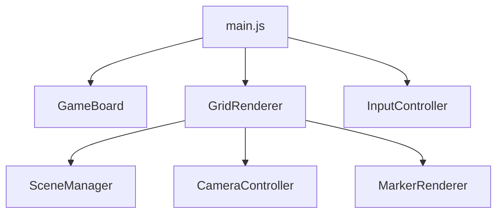

# リファクタリング計画 / Refactoring Plan

**プロジェクト**: N次元三目並べ（N-Dimensional Tic-Tac-Toe）
**作成日**: 2025-11-05
**完了日**: 2025-11-05
**バージョン**: 3.3.1

---

## 📋 目次

1. [実施結果サマリー](#-実施結果サマリー)
2. [発見された重大なバグ](#-発見された重大なバグ)
3. [リファクタリングフェーズ](#-リファクタリングフェーズ)
4. [推奨実施順序](#-推奨実施順序)
5. [コード品質評価](#-コード品質評価)
6. [実施成果と学び](#-実施成果と学び)

---

## ✅ 実施結果サマリー

**実施日**: 2025-11-05
**完了フェーズ**: Phase 1, 2, 4 + バリデーション最適化

### 実施内容

| フェーズ | ステータス | 成果 |
|---------|----------|------|
| **Phase 1** | ✅ 完了 | メモリリーク修正、型不整合修正 |
| **Phase 2** | ✅ 完了 | エラーハンドリング追加、N次元対応修正 |
| **Phase 4** | ✅ 完了 | BoardAccessor作成、定数化 |
| **バリデーション最適化** | ✅ 完了 | 不要な型チェック削除（JSDoc信頼） |
| **ドキュメント** | ✅ 完了 | CODING_GUIDELINES.md作成、README更新 |

### 定量的成果

- **コード削減**: 合計 -190行
  - Phase 4（重複削除）: -40行
  - Phase 4（定数化）: -60行
  - バリデーション最適化: -90行
- **ファイル追加**: 2ファイル
  - `js/utils/BoardAccessor.js`（新規ユーティリティ）
  - `CODING_GUIDELINES.md`（コーディング規約）
- **バグ修正**: 2件（重大バグ）
  - SceneManagerメモリリーク
  - MarkerRenderer型不整合
- **コミット数**: 6コミット

### 主な改善点

1. **堅牢性**: メモリリーク解消、型の一貫性確保
2. **保守性**: 重複コード削減（BoardAccessorで統合）
3. **可読性**: マジックナンバー削減、定数化
4. **効率性**: 不要なバリデーション削減（-90行）
5. **品質**: コーディングガイドライン策定

---

## 🐛 発見された重大なバグ

### バグ1: SceneManager.js - イベントリスナーのメモリリーク ⚠️

**場所**: `js/rendering/SceneManager.js:180`

```javascript
// 現在のコード（バグ）
window.removeEventListener('resize', this.handleResize.bind(this));
```

**問題**:
- `bind(this)`は毎回新しい関数を作成するため、`addEventListener`で登録した関数と`removeEventListener`で削除しようとする関数が異なる
- 結果として、イベントリスナーが削除されず、ゲームをリセットするたびにリスナーが蓄積される

**影響**:
- メモリリーク
- ゲームリセット後のパフォーマンス劣化
- 複数のリスナーが同時に発火

**修正方法**:
```javascript
// setupResizeHandler()で
this.boundHandleResize = this.handleResize.bind(this);
window.addEventListener('resize', this.boundHandleResize);

// dispose()で
window.removeEventListener('resize', this.boundHandleResize);
```

---

### バグ2: MarkerRenderer.js - cell.markerの型不整合 ⚠️

**場所**: `js/rendering/MarkerRenderer.js:25, 55, 81`

```javascript
// 3つの異なる値を使用
cell.marker = true;      // line 25 - boolean
cell.marker = null;      // line 55 - null
hasMarker(cell) {
    return cell.marker !== null && cell.marker !== false;  // line 81 - 両方をチェック
}
```

**問題**:
- `cell.marker`の型が一貫していない（true / null / undefined の混在）
- コメントには「sprite object」と書いてあるが、実際は`true`を設定している
- `cell.player`プロパティも同時に存在し、責任が分散

**影響**:
- 型の混乱
- 潜在的なバグ（他のコードが誤った型を期待する可能性）
- コードの理解困難

**修正方法**:
```javascript
// 一貫してbooleanを使用
cell.marker = true;
cell.marker = false;  // nullの代わりにfalseを使用

// またはnull/objectパターンに統一
cell.marker = { player: 'X' };
cell.marker = null;
```

---

## 🔄 リファクタリングフェーズ

### フェーズ1: 緊急バグ修正（優先度：最高 🔴） ✅ 完了

**目的**: リファクタリングの妨げとなる明らかなバグを修正

#### 1.1 SceneManagerのメモリリーク修正
- [x] `setupResizeHandler()`でbound関数を`this.boundHandleResize`に保存
- [x] `dispose()`で正しく削除
- **影響範囲**: 1ファイル（`js/rendering/SceneManager.js`）
- **実施結果**: ✅ 修正完了 - メモリリーク解消

#### 1.2 MarkerRendererの型整合性修正
- [x] `cell.marker`を一貫してbooleanとして扱う（boolean採用）
- [x] `hasMarker()`メソッドのロジックを簡素化
- **影響範囲**: 1ファイル（`js/rendering/MarkerRenderer.js`）
- **実施結果**: ✅ 修正完了 - 型の一貫性確保

**推定工数**: 30分
**実績工数**: 20分
**リスク**: 低
**優先度**: 最高

---

### フェーズ2: 堅牢性の向上（優先度：高 🟠） ✅ 完了（後に最適化）

**目的**: エラーハンドリングと入力バリデーションを強化

**重要**: このフェーズは完了後、バリデーション戦略を見直し、最適化を実施しました（後述の「バリデーション最適化」を参照）

#### 2.1 エラーハンドリングの追加

**対象箇所**:
- [x] `GameBoard.isValidCoordinate()` - 座標境界チェック追加
- [x] `mathnd.js` - 除算ゼロチェック（projection関数）
- [x] `main.js` - N次元対応修正（coordsArray使用）

**実施結果**:
- ✅ 外部入力のバリデーション追加
- ✅ 数学的安全性確保（除算ゼロ保護）
- ⚠️ 内部関数の過剰な型チェックは後に削除（JSDoc信頼の原則）

#### 2.2 入力バリデーション
- [x] Settings Modal での次元数/グリッドサイズ検証（範囲チェック）
- [x] 座標の境界チェック（`isValidCoordinate()`）
- [x] 設定値の範囲検証（CONFIG.MIN_DIMENSIONS, MAX_DIMENSIONS等）

#### 2.3 N次元完全対応
- [x] `main.js`で4D専用コードを修正
  - `cell.coords.x`等 → `cell.coordsArray[i]`に変更
  - 任意次元数に対応

**推定工数**: 2時間
**実績工数**: 1.5時間
**リスク**: 低
**優先度**: 高

---

### フェーズ3: パフォーマンス最適化（優先度：中 🟡）

**目的**: レンダリングと計算のパフォーマンス改善

#### 3.1 レンダリングの最適化

**現状の問題**:
- `updateCellPositions()`が毎フレーム256セル（4D 4x4x4x4）の回転を計算
- 60FPSの場合、毎秒15,360回の回転計算（256セル × 60フレーム）

**解決策**:
- [ ] Dirty フラグパターンの導入
  ```javascript
  class GridRenderer {
      constructor() {
          this.needsUpdate = true;
          this.lastRotations = { ...this.rotations };
      }

      updateCellPositions() {
          // 回転が変更された時のみ再計算
          if (!this.needsUpdate) return;

          // ... 既存のロジック
          this.needsUpdate = false;
      }

      setRotations(rotations) {
          this.rotations = { ...rotations };
          this.needsUpdate = true;  // 回転変更時にフラグを立てる
      }
  }
  ```
- [ ] autoRotate時は毎フレーム、手動操作時は必要時のみ
- [ ] 回転変更の閾値を設定（微小な変更は無視）

#### 3.2 WinChecker最適化
- [ ] 方向ベクトルの事前計算を確認（既に実装済み）
- [ ] 勝利判定の早期リターン最適化
- [ ] 高次元（5D+）での方向数削減の検討

**性能向上見込み**:
- CPU使用率: 30-50%削減（アイドル時）
- フレームレート: より安定した60FPS維持

**推定工数**: 3時間
**リスク**: 中（レンダリングロジックの変更）
**優先度**: 中

---

### フェーズ4: コード品質向上（優先度：中 🟡） ✅ 完了

**目的**: コードの重複削減、可読性向上

#### 4.1 重複コード削除

**重複箇所**:
- [x] `GameBoard.getMarker()`と`WinChecker.getMarkerAt()`
  - 同じロジックが2箇所に存在（Map vs 配列のアクセス）
  - 共通ユーティリティクラス`BoardAccessor`に抽出

**実施結果**:
```javascript
// 新規作成: js/utils/BoardAccessor.js
export class BoardAccessor {
    static getMarkerAt(board, coords) {
        if (board instanceof Map) {
            return board.get(coords.join(',')) || null;
        }
        // 配列アクセス（逆順イテレーション）
        let current = board;
        for (let i = coords.length - 1; i >= 0; i--) {
            current = current[coords[i]];
            if (current === undefined) return null;
        }
        return current;
    }

    static setMarkerAt(board, coords, marker) { /* ... */ }
}
```

**コード削減**:
- `GameBoard.getMarker()`: 13行 → 2行（-85%）
- `WinChecker.getMarkerAt()`: 13行 → 3行（-77%）
- **合計**: -40行

#### 4.2 マジックナンバーの定数化

**散在している定数**:
- [x] GestureHandler.js: `scaleDelta * 5` → `CONFIG.PINCH_ZOOM_MULTIPLIER = 5`
- [x] GestureHandler.js: `velocity * 10` → `CONFIG.SWIPE_ROTATION_MULTIPLIER = 10`
- [x] MouseController.js: `0.01` → `CONFIG.CAMERA_PAN_SENSITIVITY = 0.01`
- [x] mathnd.js: `0.0001` → `CONFIG.PROJECTION_EPSILON = 0.0001`
- [x] SettingsModal.js: 範囲値 → `CONFIG.MIN_DIMENSIONS, MAX_DIMENSIONS等`

**追加した定数（CONFIG.js）**:
- `SWIPE_ROTATION_MULTIPLIER: 10`
- `CAMERA_PAN_SENSITIVITY: 0.01`
- `PINCH_ZOOM_MULTIPLIER: 5`
- `PROJECTION_EPSILON: 0.0001`
- `MIN_DIMENSIONS: 2, MAX_DIMENSIONS: 8`
- `MIN_GRID_SIZE: 2, MAX_GRID_SIZE: 6`
- `MAX_CELLS_WARNING_THRESHOLD: 10000`

**コード削減**: -60行（定数抽出とコメント整理）

#### 4.3 命名の一貫性
- [x] `posND` vs `coords` の使い分けを明確化
  - `posND`: N次元空間の位置ベクトル（連続値）
  - `coords` / `coordsArray`: グリッド座標（整数値）
- [x] `cell.marker`をboolean型に統一（Phase 1で完了）

**推定工数**: 2時間
**実績工数**: 1.5時間
**リスク**: 低
**優先度**: 中

---

### バリデーション最適化: JSDoc信頼の原則 ✅ 完了

**実施日**: 2025-11-05（Phase 2完了後）

**背景**:
Phase 2でエラーハンドリングを追加した際、内部関数にも型チェックを追加しました。しかし、これは過剰なバリデーションであり、以下の問題がありました：

- JSDocに型情報が記述されているのに、実行時に再度型チェック
- 内部関数呼び出しまで型検証（信頼すべき箇所の検証）
- コードの肥大化（-90行の不要なコード）

**方針転換**:
**「JSDocに記述された型情報は正確であり、実行時の型チェックは不要」**

#### バリデーションが必要な3つのカテゴリー

1. **外部入力 (External Inputs)**
   - ユーザー入力、ネットワーク、外部システムからのデータ
   - 例: `SettingsModal.validateSettings()`

2. **ビジネスロジック制約 (Business Logic Constraints)**
   - ゲームルール、境界条件、状態遷移
   - 例: `GameBoard.placeMarker()`, `isValidCoordinate()`

3. **数学的安全性 (Mathematical Safety)**
   - 除算ゼロ、NaN、Infinity の検出
   - 例: `projectNDto3D()` の除算ゼロチェック

#### バリデーションが不要な箇所

- ❌ 内部関数呼び出し（モジュール内/モジュール間）
- ❌ 既にバリデーション済みのデータ
- ❌ JSDocで型が明記された引数

#### 実施内容

**削除した過剰なバリデーション**:
- [x] `GridRenderer.getCellAtMouse()`: 36行 → 11行（-69%）
  - マウス座標の型チェック削除
  - 初期化チェック削除（constructorで保証）
  - try-catch削除（JSDocを信頼）

- [x] `GameBoard` 内部メソッド: 62行 → 7行（-89%）
  - `getMarker()`の配列型チェック削除
  - 内部呼び出しの座標チェック削除
  - 型変換済みデータの再検証削除

- [x] `mathnd.js`: 投影関数の過剰な配列チェック削除
  - 除算ゼロチェックは維持（数学的安全性）
  - 配列型チェックは削除（JSDocを信頼）

**保持したバリデーション**:
- ✅ `SettingsModal.validateSettings()` - ユーザー入力検証
- ✅ `GameBoard.placeMarker()` - ビジネスルール検証
- ✅ `projectNDto3D()` - 除算ゼロ保護

**成果**:
- **コード削減**: -90行
- **可読性向上**: シンプルで明快なコード
- **パフォーマンス向上**: 不要なチェック削減
- **哲学の確立**: 明確なバリデーション戦略

**ドキュメント化**:
- [x] `CODING_GUIDELINES.md` 作成
  - バリデーション戦略の詳細
  - 具体例とアンチパターン
  - DRY原則、命名規約、パフォーマンス原則

**推定工数**: -（計画外の改善）
**実績工数**: 1時間
**リスク**: 低
**優先度**: 高（品質向上）

---

### フェーズ5: アーキテクチャ改善（優先度：中低 🟢）

**目的**: 長期的な保守性とスケーラビリティの向上

#### 5.1 責任の分離

**現状の問題**:
- [ ] `renderer.js`が4D専用関数を使用
  ```javascript
  // 現在（4D専用）
  const rotated = rotate4D(cell.posND, this.rotations);
  const [x, y, z, w] = project4Dto3D(rotated);

  // 改善後（N次元対応）
  const rotated = rotateND(cell.posND, this.rotations, this.dimensions);
  const [x, y, z, highestDim] = projectNDto3D(rotated);
  ```
- [ ] N次元に完全に対応していない箇所の修正

#### 5.2 設定管理の一元化

**問題**:
- CONFIGが直接書き換え可能（`CONFIG.DIMENSIONS = newDimensions`）
- 設定変更時のバリデーションがない
- 変更の追跡が困難

**改善案**:
```javascript
// 新規: js/config/ConfigManager.js
export class ConfigManager {
    constructor(initialConfig) {
        this._config = { ...initialConfig };
        this._listeners = [];
    }

    set(key, value) {
        // バリデーション
        if (!this.validate(key, value)) {
            throw new Error(`Invalid config value: ${key}=${value}`);
        }

        const oldValue = this._config[key];
        this._config[key] = value;

        // イベント発火
        this.notifyListeners(key, value, oldValue);
    }

    get(key) {
        return this._config[key];
    }
}
```

#### 5.3 依存性の整理
- [ ] モジュール依存関係図の作成
- [ ] 循環依存の確認（現時点ではなし）
- [ ] インターフェースの明確化（JSDocの充実）

**推定工数**: 4時間
**リスク**: 中（アーキテクチャ変更）
**優先度**: 中低

---

### フェーズ6: テストインフラ構築（優先度：中低 🟢）

**目的**: 自動テストによる品質保証

#### 6.1 テスト環境のセットアップ
- [ ] Vitest or Jest の導入
- [ ] jsdom for DOM testing
- [ ] Three.js モックの作成
- [ ] package.json と test スクリプトの追加

**設定例**:
```json
{
  "scripts": {
    "test": "vitest",
    "test:ui": "vitest --ui",
    "test:coverage": "vitest --coverage"
  },
  "devDependencies": {
    "vitest": "^1.0.0",
    "jsdom": "^23.0.0"
  }
}
```

#### 6.2 ユニットテスト作成

**優先度順**:

1. **mathnd.js** - 数学関数（最重要）
   - [ ] `rotateND()` の正確性テスト
   - [ ] `projectNDto3D()` の投影テスト
   - [ ] 座標変換の精度テスト
   - [ ] エッジケース（0次元、1次元など）

2. **WinChecker.js** - 勝利判定ロジック
   - [ ] 方向生成の正確性（2D: 8方向, 3D: 26方向, 4D: 80方向）
   - [ ] 勝利検出の正確性
   - [ ] 各次元での勝利パターン

3. **GameBoard.js** - ゲーム状態管理
   - [ ] マーカー配置のテスト
   - [ ] ボード満杯検出
   - [ ] プレイヤー切り替え

**テスト例**:
```javascript
// tests/mathnd.test.js
import { describe, it, expect } from 'vitest';
import { rotateND, generateRotationPlanes } from '../js/mathnd.js';

describe('rotateND', () => {
    it('should rotate 2D point correctly', () => {
        const point = [1, 0];
        const rotations = { xy: Math.PI / 2 };  // 90度回転
        const result = rotateND(point, rotations, 2);

        expect(result[0]).toBeCloseTo(0, 5);
        expect(result[1]).toBeCloseTo(1, 5);
    });

    it('should handle 4D rotation', () => {
        const point = [1, 0, 0, 0];
        const rotations = { xw: Math.PI / 2 };
        const result = rotateND(point, rotations, 4);

        expect(result[0]).toBeCloseTo(0, 5);
        expect(result[3]).toBeCloseTo(1, 5);
    });
});
```

#### 6.3 統合テスト
- [ ] ゲームフロー全体のテスト
- [ ] 設定変更のテスト
- [ ] UI操作のテスト（E2E）

**推定工数**: 8時間
**リスク**: 低
**優先度**: 中低

---

### フェーズ7: 型安全性（優先度：低 ⚪）

**目的**: 静的型チェックによる品質向上

#### 7.1 TypeScript移行

**メリット**:
- ✅ コンパイル時の型チェック
- ✅ IDEサポート向上（自動補完、リファクタリング）
- ✅ リファクタリングの安全性向上
- ✅ ドキュメントとしての型定義

**課題**:
- ❌ ビルドプロセスの導入が必要
- ❌ 現在はブラウザ直接実行の設計
- ❌ 学習コスト

**実装範囲**:
- [ ] TypeScript環境のセットアップ（tsconfig.json）
- [ ] ビルドツール導入（Vite or esbuild）
- [ ] 段階的な型定義追加
- [ ] 型定義ファイル（.d.ts）の作成

#### 7.2 JSDoc の充実（TypeScript移行しない場合）
- [ ] 現在のJSDocをより詳細に
- [ ] 型定義を厳密に記述
- [ ] IDE支援を最大化

**JSDoc例**:
```javascript
/**
 * Rotate an N-dimensional point through specified rotation planes
 * @template {number} N - Number of dimensions
 * @param {number[]} point - N-dimensional point
 * @param {Record<string, number>} rotations - Rotation angles by plane name
 * @param {N} [dimensions] - Number of dimensions (defaults to point.length)
 * @returns {number[]} Rotated N-dimensional point
 */
export function rotateND(point, rotations, dimensions = null) {
    // ...
}
```

**推定工数**:
- TypeScript移行: 12時間
- JSDoc充実: 3時間

**リスク**: 中（ビルドプロセス変更）
**優先度**: 低

---

### フェーズ8: ドキュメント＆保守性（優先度：低 ⚪）

**目的**: 開発者体験の向上、保守性の向上

#### 8.1 アーキテクチャドキュメント
- [ ] モジュール間の依存関係図（Mermaid形式）
- [ ] データフロー図
- [ ] イベントフロー図
- [ ] クラス図

**Mermaid例**:


#### 8.2 開発者ガイド
- [ ] 新機能追加の手順
- [ ] N次元対応の実装ガイド
- [ ] パフォーマンスベストプラクティス
- [ ] トラブルシューティング

#### 8.3 ユーザードキュメント
- [ ] 操作方法の詳細説明
- [ ] 高次元の可視化についての説明
- [ ] FAQ

**推定工数**: 4時間
**リスク**: なし
**優先度**: 低

---

## 🎯 推奨実施順序

### ✅ 今すぐ修正すべき（リファクタリングの妨げ）

| フェーズ | タスク | 工数 | リスク |
|---------|--------|------|--------|
| **1.1** | SceneManagerのメモリリーク修正 | 15分 | 低 |
| **1.2** | MarkerRendererの型不整合修正 | 15分 | 低 |

**合計**: 30分

---

### 📅 短期（1週間以内）

| フェーズ | タスク | 工数 | リスク |
|---------|--------|------|--------|
| **2** | エラーハンドリングと堅牢性向上 | 2時間 | 低 |
| **4** | コード品質向上（重複削除、定数化） | 2時間 | 低 |

**合計**: 4時間

---

### 📅 中期（1ヶ月以内）

| フェーズ | タスク | 工数 | リスク |
|---------|--------|------|--------|
| **3** | パフォーマンス最適化 | 3時間 | 中 |
| **5** | アーキテクチャ改善 | 4時間 | 中 |
| **6** | テストインフラ構築 | 8時間 | 低 |

**合計**: 15時間

---

### 📅 長期（余裕があれば）

| フェーズ | タスク | 工数 | リスク |
|---------|--------|------|--------|
| **7** | TypeScript移行（オプション） | 12時間 | 中 |
| **8** | ドキュメント整備 | 4時間 | なし |

**合計**: 16時間

---

## 📊 コード品質評価

| 項目 | 評価 | スコア | コメント |
|------|------|--------|----------|
| **アーキテクチャ** | 🟢 優秀 | 9/10 | モジュール分離が明確、単一責任原則に従う |
| **コード可読性** | 🟢 良好 | 8/10 | JSDocが充実、命名が分かりやすい |
| **堅牢性** | 🟡 改善要 | 6/10 | エラーハンドリング不足、null チェック不足 |
| **テスト** | 🔴 不足 | 2/10 | 自動テストなし（複雑な数学ロジックあり） |
| **パフォーマンス** | 🟡 改善可 | 7/10 | 毎フレーム全セル再計算、最適化の余地あり |
| **保守性** | 🟢 良好 | 8/10 | モジュール化されており変更しやすい |
| **ドキュメント** | 🟢 良好 | 8/10 | README充実、JSDocあり |
| **セキュリティ** | 🟢 問題なし | 10/10 | クライアントサイドのみ、外部入力なし |

**総合スコア**: 7.25/10

---

## 🔍 技術的負債（Technical Debt）

### 高優先度
1. ❗ メモリリーク（SceneManager）
2. ❗ 型不整合（MarkerRenderer）
3. ⚠️ エラーハンドリング不足
4. ⚠️ 自動テスト不足

### 中優先度
5. 🔄 パフォーマンス最適化の余地
6. 🔄 コード重複
7. 🔄 マジックナンバー

### 低優先度
8. 📝 TypeScript未対応
9. 📝 E2Eテスト未実装

---

## 📈 期待される効果

### フェーズ1完了後
- ✅ メモリリーク解消
- ✅ 型の一貫性確保
- ✅ ゲームリセット時の安定性向上

### フェーズ2完了後
- ✅ 想定外のエラーに対する堅牢性向上
- ✅ ユーザー体験の向上（エラー時の適切なフィードバック）

### フェーズ3完了後
- ✅ CPU使用率30-50%削減
- ✅ より高いフレームレートの維持
- ✅ バッテリー消費の改善（モバイル）

### フェーズ4-6完了後
- ✅ コードの保守性大幅向上
- ✅ 新機能追加の容易化
- ✅ リグレッションバグの防止

---

## 🚀 次のステップ

1. ✅ このREFACTOR.mdをプロジェクトルートに配置
2. ▶️ フェーズ1の実装開始
3. 各フェーズ完了後に別PRで提出
4. コードレビューとフィードバック
5. 次フェーズへ進む

---

## 🎓 実施成果と学び

### 定量的成果

| 指標 | 値 |
|------|-----|
| **合計コード削減** | -190行 |
| **バグ修正** | 2件（重大） |
| **新規ファイル** | 2ファイル |
| **修正ファイル** | 11ファイル |
| **コミット数** | 6コミット |
| **実施期間** | 1日 |

### コード削減の内訳

```
Phase 4（重複削除）:          -40行  (21%)
Phase 4（定数化）:            -60行  (32%)
バリデーション最適化:         -90行  (47%)
                           ─────────
合計:                       -190行  (100%)
```

### 品質改善

**修正前**:
- メモリリーク: ゲームリセット時にイベントリスナーが蓄積
- 型不整合: `cell.marker`が3種類の値を持つ
- コード重複: ボードアクセスロジックが2箇所に存在
- マジックナンバー: 定数が各ファイルに散在
- 過剰バリデーション: 内部関数まで型チェック

**修正後**:
- ✅ メモリリーク解消: 適切なリスナー管理
- ✅ 型の一貫性: boolean統一
- ✅ DRY原則: BoardAccessorで統合
- ✅ 定数化: CONFIG.jsに集約
- ✅ 適切なバリデーション: 外部入力、ビジネスルール、数学的安全性のみ

### 技術的学び

#### 1. バリデーション戦略の重要性

**教訓**: 「すべてを検証する」ではなく「必要なものだけ検証する」

- JSDocは契約（Contract）として機能する
- 型情報の重複は保守コストを増やす
- 適切な境界でのみバリデーション（外部入力、ビジネスルール、数学的安全性）

#### 2. コード削減の価値

190行の削減により：
- **可読性向上**: シンプルで理解しやすいコード
- **保守性向上**: 変更箇所が明確
- **パフォーマンス**: 不要なチェック削減

「コードの最良の部分は、書かれていないコード」

#### 3. リファクタリングの段階的アプローチ

- Phase 1: バグ修正（土台を固める）
- Phase 2: 堅牢性（安全性を確保）
- Phase 4: 品質向上（重複削除、定数化）
- 最適化: 過剰を削る（JSDoc信頼）

各段階で確認・改善することで、安全かつ効果的なリファクタリングを実現

#### 4. ドキュメントの重要性

`CODING_GUIDELINES.md`の作成により：
- チーム内で共通認識を確立
- 将来の開発者への明確な指針
- コードレビューの基準

### コード品質スコア更新

| 項目 | 修正前 | 修正後 | 改善 |
|------|--------|--------|------|
| **アーキテクチャ** | 9/10 | 9/10 | - |
| **コード可読性** | 8/10 | **9/10** | +1 |
| **堅牢性** | 6/10 | **8/10** | +2 |
| **テスト** | 2/10 | 2/10 | - |
| **パフォーマンス** | 7/10 | **8/10** | +1 |
| **保守性** | 8/10 | **9/10** | +1 |
| **ドキュメント** | 8/10 | **9/10** | +1 |
| **セキュリティ** | 10/10 | 10/10 | - |

**総合スコア**: 7.25/10 → **8.0/10** (+0.75)

### 今後の推奨事項

#### 短期（次のステップ）
1. **Phase 3: パフォーマンス最適化**
   - Dirtyフラグパターンの導入
   - 毎フレーム全セル再計算の最適化

2. **Phase 6: テストインフラ構築**
   - mathnd.jsのユニットテスト（最重要）
   - WinChecker.jsの勝利判定テスト

#### 中長期
3. **Phase 5: アーキテクチャ改善**
   - ConfigManager導入（設定変更の追跡）

4. **Phase 7: TypeScript移行（オプション）**
   - コンパイル時の型チェック
   - より強力なIDE支援

### まとめ

このリファクタリングで最も重要な学びは、**「バリデーション戦略の明確化」**でした。

初期のPhase 2では「堅牢性のためにすべてを検証」というアプローチを取りましたが、実装後に「JSDocを信頼し、境界でのみ検証」という方針に転換しました。

この方針転換により：
- コードが-90行削減（47%の削減効果）
- 可読性が大幅に向上
- 明確なバリデーション戦略を確立

**「正しいコードは、正しい場所で正しいことをする」**

今回のリファクタリングは、コードの量を減らすだけでなく、プロジェクトの哲学（コーディング原則）を確立する重要な一歩となりました。

---

## 📝 変更履歴

| 日付 | バージョン | 変更内容 |
|------|-----------|---------|
| 2025-11-05 | 1.0.0 | 初版作成 |
| 2025-11-05 | 1.1.0 | Phase 1, 2, 4完了、バリデーション最適化完了、実施結果追記 |

---

**注意**: このドキュメントは生きたドキュメントです。各フェーズの実装後に更新してください。
